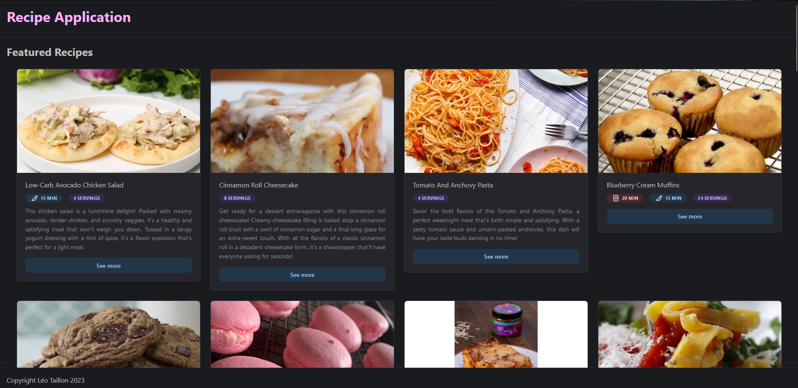

Sample application made with Next.Js and Mantine for viewing recipes from [Tasty from RapidApi](https://rapidapi.com/apidojo/api/tasty) : 



## Getting Started
1. Install required depedencies by running `npm install`
2. Create a `.env` file in the project's root folder
3. Get an api key for [Tasty from RapidApi](https://rapidapi.com/apidojo/api/tasty)
4. Add four variables in this file:
```
NEXT_PUBLIC_RECIPE_INFO_URL=https://tasty.p.rapidapi.com/recipes/get-more-info
NEXT_PUBLIC_RECIPE_SUMMARY_URL=https://tasty.p.rapidapi.com/recipes/list
NEXT_PUBLIC_API_KEY=YOUR API KEY
NEXT_PUBLIC_API_HOST=tasty.p.rapidapi.com
```
5. Launch the application with `npm run dev` or using Visual Studio Code `launch.json` file
